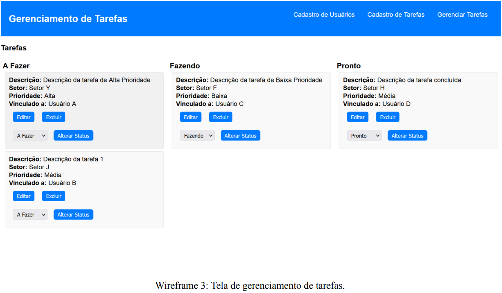

# 🗂️ Sistema de Gerenciamento de Tarefas (To Do List)

Sistema simples com funcionalidades CRUD para controle de tarefas e seus respectivos status (A Fazer, Fazendo, Pronto), utilizando o modelo Kanban.

---

## 📘 Situação de Aprendizagem

### 🏭 Contexto
Uma indústria do ramo alimentício utiliza o modelo Kanban para gerenciar as tarefas dos seus setores. O controle atual é feito de forma simplificada, sem mapeamento detalhado dos fluxos, e dividido apenas em três etapas: **A Fazer**, **Fazendo** e **Pronto**.

O Kanban é utilizado por promover transparência e visibilidade para toda a equipe. No entanto, a empresa quer evoluir esse controle, permitindo **integração entre setores** e **maior visibilidade** das tarefas.

---

## 🎯 Desafio

Com base nos conhecimentos adquiridos no curso, crie uma aplicação completa de gerenciamento de tarefas com as seguintes especificações:

### 📌 Dados do Usuário:
- ID
- Nome
- E-mail

### 📌 Dados da Tarefa:
- ID da tarefa
- ID do usuário vinculado
- Descrição
- Nome do setor
- Prioridade (Baixa, Média, Alta)
- Data de cadastro
- Status (A Fazer, Fazendo, Pronto) — *por padrão, será "A Fazer"*

**Regras:**
- Um usuário pode cadastrar várias tarefas.
- Cada tarefa pertence a apenas um usuário.
- Tarefas podem ser atualizadas (status e/ou prioridade).
- Todas as tarefas devem ser exibidas em colunas baseadas no status.

---

## 📦 Entregas

| Nº | Entrega | Descrição |
|----|---------|-----------|
| 1 | Diagrama Entidade-Relacionamento (DER) | Modelo lógico do banco de dados com base na regra de negócio. |
| 2 | Criação do Banco de Dados | Script SQL com a estrutura do banco de dados, incluindo tabelas, relacionamentos e constraints. |
| 3 | Diagrama de Casos de Uso | Representação dos atores, ações e fluxos do sistema. |
| 4 | Tela de Cadastro de Usuários | Interface para cadastrar novos usuários, com validação de e-mail e mensagens de sucesso. |
| 5 | Tela de Cadastro de Tarefas | Interface para criação de tarefas associadas a usuários já cadastrados. |
| 6 | Tela de Gerenciamento de Tarefas | Interface principal do sistema, com visualização, edição, exclusão e atualização de status. |

---

## 📊 1. Diagrama Entidade-Relacionamento (DER)

Crie um DER completo contendo:
- Tabelas
- Campos obrigatórios
- Chaves primárias e estrangeiras
- Relacionamentos

**Formato de entrega:** `.jpg` ou outro combinado com o avaliador.

---

## 🧱 2. Criação do Banco de Dados

Com base no DER:
- Crie a estrutura física do banco
- Todos os campos devem ser obrigatórios
- Exporte a estrutura e dados em formato `.sql`

---

## 🧩 3. Diagrama de Casos de Uso

Crie um diagrama que represente:
- Atores (usuários)
- Casos de uso (ações que podem executar)
- Fluxo de interações

**Formato de entrega:** `.jpg`

---

## 👤 4. Tela de Cadastro de Usuários

Requisitos:
- Campos obrigatórios: nome e e-mail
- Validação de e-mail
- Mensagem de sucesso: “Cadastro concluído com sucesso”
- Inserção de dados no banco
- Acessível pelo menu principal

📌 **Wireframe de referência:**  

---

## ✏️ 5. Tela de Cadastro de Tarefas

Requisitos:
- Campos obrigatórios conforme regra de negócio
- Campo de usuário com dados recuperados do banco
- Seleção de prioridade: baixa, média ou alta
- Mensagem de sucesso após cadastro
- Acessível pelo menu principal

📌 **Wireframe de referência:**  

---

## 🛠️ 6. Tela de Gerenciamento de Tarefas

Requisitos:
- Primeira tela ao iniciar o sistema
- Interface tipo Kanban com 3 colunas: A Fazer, Fazendo, Pronto
- Exibição das tarefas com:
  - Descrição
  - Setor
  - Prioridade
  - Usuário vinculado
- Botões:
  - **Editar** (redireciona para a tela de cadastro com dados preenchidos)
  - **Excluir** (com confirmação)
  - **Alterar status** (via `select` + botão atualizar)

📌 **Wireframe de referência:**  

---

## 📁 Estrutura de Entrega

- `./docs/`
  - `diagrama-der.png`
  - `caso-de-uso.png`
  - `banco-de-dados.sql`
- `./web/`
  - Front-end do sistema
- `./docs/`
  - Back-end do sistema

---

## 🎨 Estilo e Layout

- **Fonte padrão:** Segoe UI
- **Cores principais:**

| Cor | RGB | Hexadecimal |
|-----|-----|-------------|
| Branco | 255, 255, 255 | `#FFFFFF` |
| Azul Escuro | 0, 86, 179 | `#0056b3` |
| Preto | 0, 0, 0 | `#000000` |

---

## 📣 Observações Finais

Caso alguma tela/modal não tenha sido finalizada, **adicione botões ou links** para indicar a sua existência ou navegação. O mais importante é representar a estrutura completa da aplicação, mesmo que parcialmente funcional.